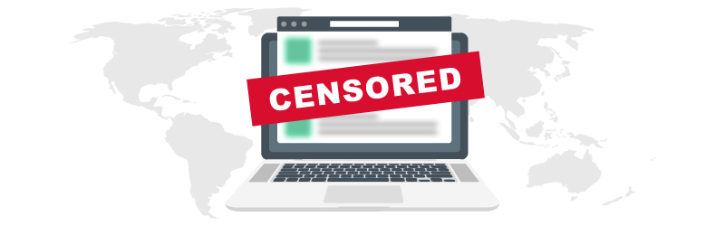

# <h3> This project is a personal effort to circumvent Internet censorship and provide free Internet access for all the poeple living in a totalitarian dictatorship regime like Iran, Russia and China. </h3>

<strong>This repo gets updated over the time...</strong>  
>
