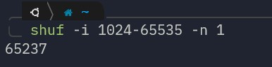
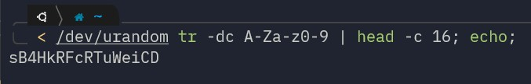

# <h2> This guide explain how to run a shadosocks server on docker </h2>

1. Generate a random port with command: <strong> `shuf -i 1024-65535 -n 1`  </strong> replace it in "server_port" section in config.json 
     
2. Generate a strong passowrd with command:  <strong>`< /dev/urandom tr -dc A-Za-z0-9 | head -c 16; echo;` </strong> replace the output in password section of config.json    
   
3. Create proper directory with command:  <strong>`sudo mkdir /etc/shadowsocks-rust`</strong>

4. Copy edited config.json to the folder that you've just created:  <strong> `copy config.json /etc/shadowsocks-rust`</strong>

5. Open the generated port on firewall:   <strong>`sudo ufw allow 65237/tcp`   `sudo ufw allow 65237/udp`</strong>

6. Execute the docker-compose file:  <strong>`docker-compose up -d`</strong>

7. Now ssh into iran server and from there ssh into your foreign server one time in other to add its fingerprint into known host file.

8. Edit the <strong><code>tunnel.sh</code></strong> file and replace these properties correctly: 

   - `<iran server port>` with generated port, in our case it was <strong>`65237`</strong> (Iran server port could be different but for simplicity we use the same port)
   - `<foreign server port>` with generated port, in our case it was <strong>`65237`</strong>
   - `<user>` with username on foreign server with which we can ssh into foreign server.
   - `<foreign server public ip address>` with public ip address of foreign server.

9. The final command should be something like this:   <code><strong> ssh -4 -f -N -o GatewayPorts=true -L 65237:0.0.0.0:65237 ubuntu@192.168.1.1</code></strong>  or you can use `sshutle ` package like this:  
   <code><strong>sshuttle --dns -D -r user@foreign-ip 0/0 -x iran-ip/32 --no-latency-control --listen=0.0.0.0:0</code></strong>

10. Make the <strong><code>tunnel.sh</code></strong> executeable with:  `chmod +x tunnel.sh`

11. Run the script it will run in the background and you should get a message like: <strong>SSH Tunnel has been created successfully!</strong>

12. Add script to crontab so when server restarts, it automatically create ssh tunnel:

    - Run <strong>`crontab -e`</strong>
    - Put the <strong>`tunnel.sh`</strong> in your home folder.
    - add line below to crontab: <strong> `@reboot ~/tunnel.sh >> ~/tunnel.log 2>&1`</strong>

13. Now connect the client with ip address of iran server with generated port and generated password.

# <h2> To run a fast socks5 proxy: </h2>

1. Run this command: 
   <strong>`ssh -D8080 -fCqN user@remote-host`</strong>
   - -f: Requests ssh to go to background just before command execution
   - -C: Requests compression of all data
   - -q: Quiet mode. Causes most warning and diagnostic messages to be suppressed
   - -N: Do not execute a remote command
2. Then check if the tunnel is running: 
   <strong>`ss -natp | grep 8080`</strong>

3. Test it with: 
   <strong>`curl -x socks5h://127.0.0.1:8080 ifconfig.me`</strong>

<h2><strong> Port Scan Prevention Script </strong></h2>

How this works:

Here we store scanned ports in scanned_ports set and we only count newly scanned ports on our hashlimit rule. If a scanner send packets to 5 different port(see --hashlimit-burst 5) that means it is a probably scanner so we will add it to port_scanners set.

Timeout of port_scanners is the block time of scanners(10 minutes in that example). It will start counting from beginning (see --exist) till attacker stop scan for 10 seconds (see --hashlimit-htable-expire 10000)

You can set these parameters to most proper values for you.

Be aware of that someone can make any IP blocked by just make scan as spoofing. I suggest you don't set block timeout too long.

<strong><h3>How to create white-list:</h3></strong>

If you want to add a whitelist, create a whitelisted list:  
<code><strong>ipset create whitelisted hash:net</code></strong>

and change drop rule with that:

<code><strong>iptables -A INPUT -m state --state NEW -m set --match-set port_scanners src -m set ! --match-set whitelisted src -j DROP</code></strong>
